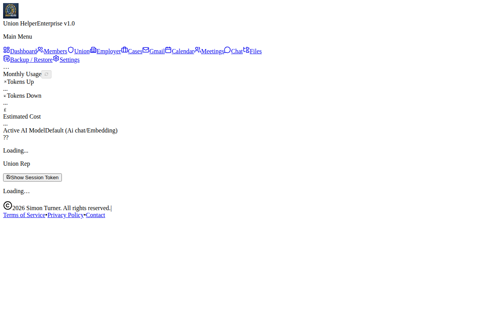
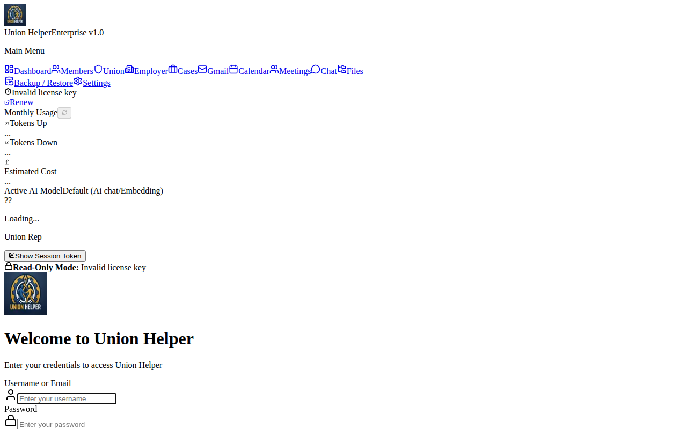
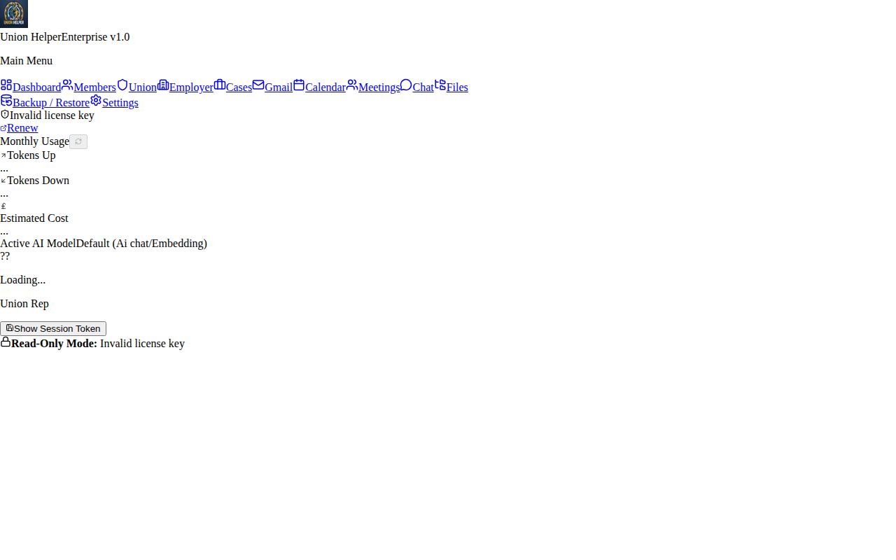
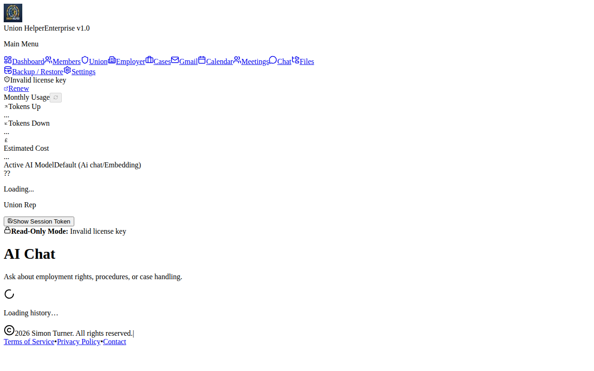
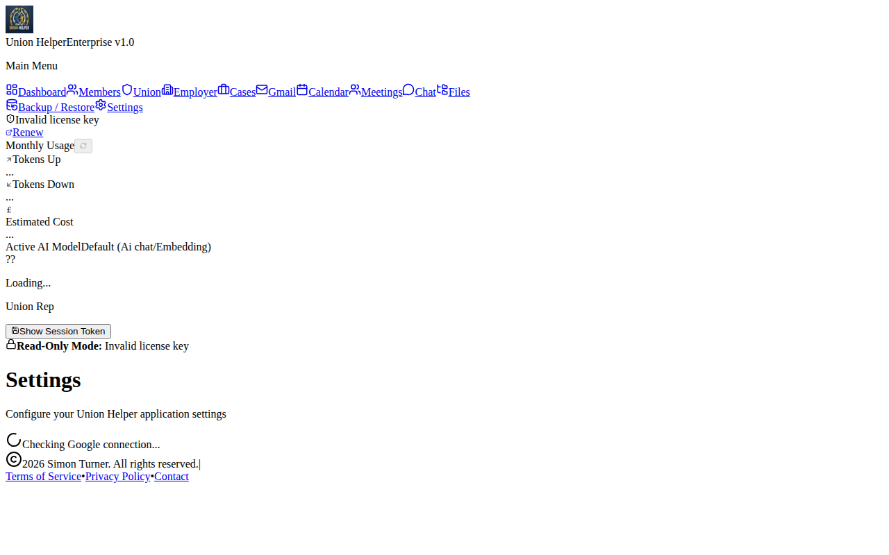

# Union Helper — User Manual

**Version 1.0 | April 2026 | api.unionhelper.co.uk**

---

## Overview

Union Helper is a subscription-based AI productivity tool with token-based add-ons. This manual covers the web application, API, and core workflows.

---

## Getting Started

### 1. Download & Install the App

Union Helper is a **downloadable desktop application** that runs locally on your computer.

**System Requirements:**
- Windows 10+, macOS 11+, or Ubuntu 20.04+
- 4GB RAM minimum (8GB recommended)
- 500MB free disk space
- Internet connection for authentication and AI features

**Installation Steps:**

1. Go to [unionhelper.co.uk/downloads](/downloads)
2. Download the version for your operating system:
   - **Windows:** `UnionHelper-Setup.exe` or `.msi`
   - **macOS:** `UnionHelper.dmg`
   - **Linux:** `UnionHelper.AppImage` or `.deb`
3. Run the installer and follow the on-screen instructions
4. Launch **Union Helper** from your Start Menu / Applications folder

### 2. Create an Account

1. Go to [unionhelper.co.uk](https://unionhelper.co.uk)
2. Click **Sign Up**
3. Enter your email and create a password
4. Verify your email address

### 2. Subscribe

| Plan | Price | Features |
|------|-------|----------|
| **Base Monthly** | £25/month | Core AI features, Google login |
| **+ Embedding** | £0.20/token | Vector embeddings for your data |
| **+ Agent** | £18.88 prepaid | AI agent automation |
| **+ Pay-as-You-Go** | From £3.78/1M tokens | Flexible token billing |

### 3. Install (Optional Desktop/App)

The Union Helper app runs locally. Start it with:

```bash
cd UnionHelper-App
npm install
npm run dev
```

Access at [http://localhost:3000](http://localhost:3000)

---

## Application Screenshots

The Union Helper desktop app running on your local computer:

### App - Homepage


### App - Registration


### App - Login


### App - Dashboard


### App - RAG / Embeddings


### App - AI Chat


### App - Settings


### App - Token Balance


---

## API Reference

### Base URL
```
https://api.unionhelper.co.uk/api
```

### Authentication

All admin endpoints require a JWT token:

```
Authorization: Bearer <your_token>
```

### Endpoints

#### Health Check
```
GET /api/health
```
Returns:
```json
{
  "status": "healthy",
  "services": {
    "zai": { "status": "ok" },
    "huggingface": { "status": "ok" }
  }
}
```

#### Pricing
```
GET /api/pricing
```
Returns:
```json
{
  "base": { "monthly": 25 },
  "embedding": { "prepaid": 0.2, "payg": 0.2 },
  "agent": { "prepaid": 18.88, "paygInput": 3.78, "paygOutput": 15.1 },
  "currency": "GBP"
}
```

#### Token Balance
```
GET /api/tokens/balance/:licenseId
Authorization: Bearer <admin_token>
```

#### Deduct Tokens
```
POST /api/tokens/deduct
Authorization: Bearer <admin_token>
Body: { "licenseId": "...", "addOnType": "...", "amount": 100 }
```

---

## Subscription Workflow

```
User Signs Up → Stripe Checkout → License Created → AI Features Enabled
                                              ↓
                                    Token Add-ons Available
                                              ↓
                              Stripe Webhook → Balance Updated
```

### Add-on Flow

1. User purchases tokens via Stripe
2. Payment confirmed via webhook
3. Token balance credited to their license
4. Balance checked before each AI request
5. Balance deducted after each request

---

## Security Features

### Token Protection
- Over-consume protection — requests rejected if balance insufficient
- Real-time balance tracking
- Depletion notifications at 20% threshold

### Admin Authentication
- JWT-based admin access
- License key validation
- TOTP support

### Webhook Idempotency
- Duplicate Stripe events are detected and skipped
- Event IDs stored to prevent double-processing

---

## Troubleshooting

### 401 Unauthorized
Ensure your admin JWT token is valid and passed correctly:
```
Authorization: Bearer <your_token>
```

### 404 on API Calls
Check that the API server is running at `api.unionhelper.co.uk`

### Token Balance Not Updating
1. Check Stripe dashboard for successful payment
2. Verify webhook is configured in Stripe settings
3. Check server logs for webhook errors

### App Won't Start (localhost:3000)
```bash
cd UnionHelper-App
npm install
npm run dev:no-browser
```

---

## Architecture

```
┌─────────────────────────────────────────┐
│     Customer's PC (Union Helper App)    │
│   ┌─────────────────────────────────┐   │
│   │  UnionHelper-App (Next.js)      │   │
│   │  Runs locally: localhost:3000   │   │
│   │  Stores data locally (SQLite)   │   │
│   │  Authenticates via api.unionhelper.co.uk │
│   └──────────────┬──────────────────┘   │
│                  │ HTTPS               │
└──────────────────│──────────────────────┘
                   │
         ┌─────────▼─────────┐
         │  api.unionhelper.co.uk  │
         │     (Node.js API)       │
         │  Billing + Auth         │
         └─────────┬─────────────┘
                   │
         ┌─────────▼─────────┐
         │   Stripe          │
         │   (Billing)       │
         └───────────────────┘
```

**Note:** The app runs entirely on the customer's PC. All data (cases, documents, embeddings) is stored locally in SQLite. The app only connects to the internet for authentication, billing, and AI services.

---

## Pricing (GBP)

| Feature | Prepaid | Pay-As-You-Go |
|---------|---------|--------------|
| Base (monthly) | £25 | — |
| Embedding | £0.20/token | £0.20/token |
| Agent (AI) | £18.88 | £3.78/1M input, £15.10/1M output |
| GPT-4o | — | £3.78/1M input, £15.10/1M output |

---

*Manual generated: April 2026 | Union Helper v1.0*
